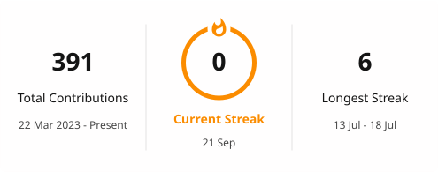

## Florencia del Castillo

**Cloud & Software · AWS.** Construyo infraestructura serverless y en contenedores, y documento las
decisiones detrás de cada proyecto. 
Ayudante de cátedra en la UNViMe. 
Villa Mercedes, San Luis 🇦🇷

<a href="#english">🇬🇧 Read in English</a>

---

## Proyectos

### Mi Plan de Estudios — planificador académico

Te dice qué materias podés cursar, qué te está trabando y qué te falta para recibirte — y te avisa
por WhatsApp cuando se acerca una fecha del calendario académico. Modela el plan de estudios como un
grafo de correlativas e importa tu historial parseando el reporte de SIU Guaraní o un Excel, así no
cargás materia por materia. Corre en una EC2 con Docker Compose: API (Node + Express + MongoDB) y
frontend en contenedores separados detrás de Nginx, con dominio propio y TLS de Let's Encrypt. Un
cron revisa el calendario y notifica por WhatsApp (Baileys) y email.

       

[**▸ Probalo**](https://miplandeestudios.com.ar) · en producción, con usuarios reales

### Claudito — optimizador de CVs con IA

Subís un CV, pegás una descripción de puesto, y te devuelve un score de match, sugerencias concretas
que aceptás o descartás una por una, y un PDF en formato Harvard listo para mandar — con una
restricción central: **no inventa nada**, todo lo que escribe tiene que estar respaldado por el CV
original. Es 100% serverless: nueve Lambdas, dos llamadas a Bedrock y ninguna base de datos, porque
sin login no hay estado que persistir — una sesión es una carpeta en S3 que se autodestruye en una
hora. Los PDFs escaneados se procesan con OCR async (Textract); IaC con SAM y deploy por CI/CD con
OIDC.

        

[**▸ Probalo**](https://d1u1sqpu5ny5ot.cloudfront.net) · desplegado

### Dockyard — plataforma de deploy tipo Render/Railway

Conectás un repositorio, hacés `git push`, y tu app queda viva en su propio subdominio con HTTPS
válido. Es un proyecto de infraestructura pensado para ser defendible pieza por pieza: en vez de usar
un PaaS, lo construye — build de imágenes Docker, registry propio (ECR), reverse proxy que rutea por
subdominio, TLS wildcard, y separación control plane / data plane sobre una misma EC2. **Hoy está en
Fase 0:** la infraestructura es reproducible desde cero con CloudFormation (EC2, ECR, IAM, alarmas de
presupuesto), TLS wildcard vía ACME DNS-01, Nginx ruteando por `Host` y CI con OIDC — sin access keys
estáticas — pero los deploys todavía se disparan a mano. El pipeline automático (webhook → build →
deploy) es la Fase 1.

      

[**▸ Demo**](https://demo.dockyard.dpdns.org) · Fase 0, infraestructura reproducible

### Costos — gestión para PyMEs gastronómicas

Para que el dueño o dueña de un local gastronómico administre su negocio sin saber de contabilidad:
ventas, gastos, costos, punto de equilibrio, facturación electrónica (ARCA/WSFE) y un asistente que
responde en lenguaje natural con los números reales del negocio. Se cargan datos a mano, con una foto
del ticket (la IA los extrae y clasifica) o con el CSV de "Mis Comprobantes" de ARCA en lote.
Frontend React + Vite con el estado en el navegador; una sola Lambda con dos integraciones — Bedrock
(Claude) para la IA y Afip SDK para ARCA. Regla de diseño: se guardan solo productos, ventas y
comprobantes; costo unitario, CIF, equilibrio y alertas se derivan y nunca se persisten.

     

_Estado: corre local contra la Lambda; todavía sin instancia pública._

---

## Sobre mí

Estudio Ingeniería en Sistemas de Información en la UNViMe (2022–presente) y soy **ayudante de
cátedra** en *Expresión y Resolución de Problemas y Algoritmos* y *Programación I*. Co-fundé el
**Club de Programación de la UNViMe** y di talleres y charlas en la Semana de la Ingeniería: Git,
HTML/CSS, Notion para ingenieros, y *Primeros Pasos en la Nube con AWS* junto al AWS User Group San
Luis.

**Cómo llegué:** freeCodeCamp → backend con Java en la Universidad Globant (beca Code Your Future) →
AWS Re/Start en Potrero Digital → [**AWS Certified Cloud Practitioner**](https://www.credly.com/badges/736b6e0f-4c60-4a82-aa06-105653a22aae/public_url) (enero 2026). Ahora: Dockyard
Fase 2 y CI/CD en Claudito.

### Herramientas

| | |
|---|---|
| **Cloud** | Lambda · S3 · Bedrock · CloudFront · API Gateway · EC2 · ECR · Textract · CloudWatch · IAM · VPC |
| **IaC** | AWS SAM · CloudFormation |
| **Lenguajes** | Python · TypeScript · JavaScript · SQL · Bash |
| **Frontend** | React · Vite · Tailwind · Zustand |
| **Ops** | Docker · Docker Compose · GitHub Actions (OIDC) · Nginx · Linux · DNS |

### Contacto

- [LinkedIn](https://linkedin.com/in/flordelcastillo) · Inglés B2

---

<h2 id="english">🇬🇧 Florencia del Castillo</h2>

**Cloud & Software · AWS.** I build serverless and containerized infrastructure, and I document the
decisions behind every project. Teaching assistant at UNViMe. Villa Mercedes, San Luis 🇦🇷

## Projects

### Mi Plan de Estudios — academic planner

Tells you what courses you can take, what's blocking you, and what's left before you graduate — and
pings you on WhatsApp when an academic-calendar date is coming up. It models the curriculum as a
prerequisite graph and imports your record by parsing the SIU Guaraní report or an Excel file, so you
don't type subject by subject. It runs on one EC2 box with Docker Compose: API (Node + Express +
MongoDB) and frontend in separate containers behind Nginx, with its own domain and Let's Encrypt TLS.
A cron checks the calendar and notifies over WhatsApp (Baileys) and email.

       

[**▸ Try it**](https://miplandeestudios.com.ar) · in production, with real users

### Claudito — AI CV optimizer

Upload a CV, paste a job description, and get a match score, concrete suggestions you accept or
dismiss one by one, and a ready-to-send Harvard-format PDF — with one core constraint: **it invents
nothing**, everything it writes must be backed by the original CV. It's fully serverless: nine
Lambdas, two Bedrock calls, and no database, because without login there's no state to persist — a
session is an S3 folder that deletes itself in an hour. Scanned PDFs are handled with async OCR
(Textract); IaC with SAM and CI/CD deploys over OIDC.

        

[**▸ Try it**](https://d1u1sqpu5ny5ot.cloudfront.net) · deployed

### Dockyard — a Render/Railway-style deploy platform

Connect a repo, `git push`, and your app is live on its own subdomain with valid HTTPS. It's an
infrastructure project meant to be defensible piece by piece: instead of using a PaaS, it builds one
— Docker image builds, its own registry (ECR), a reverse proxy that routes by subdomain, wildcard
TLS, and a control-plane / data-plane split on a single EC2. **It's at Phase 0 today:** the
infrastructure is reproducible from scratch with CloudFormation (EC2, ECR, IAM, budget alarms),
wildcard TLS via ACME DNS-01, Nginx routing by `Host`, and CI over OIDC — no static access keys — but
deploys are still triggered by hand. The automated pipeline (webhook → build → deploy) is Phase 1.

      

[**▸ Demo**](https://demo.dockyard.dpdns.org) · Phase 0, reproducible infrastructure

### Costos — management for small restaurants

So a restaurant owner can run their business without knowing accounting: sales, expenses, costs,
break-even, electronic invoicing (ARCA/WSFE), and an assistant that answers in plain language using
the business's real numbers. Data is entered by hand, by photo of the receipt (AI extracts and
classifies it), or from the ARCA "Mis Comprobantes" CSV in bulk. React + Vite frontend with state in
the browser; a single Lambda with two integrations — Bedrock (Claude) for AI and the Afip SDK for
ARCA. Design rule: only products, sales, and receipts are stored; unit cost, overhead, break-even,
and alerts are all derived and never persisted.

     

_Status: runs locally against the Lambda; no hosted instance yet._

## About me

I'm studying Information Systems Engineering at UNViMe (2022–present) and I'm a **teaching assistant**
for *Problem Solving & Algorithms* and *Programming I*. I co-founded the **UNViMe programming club**
and gave workshops and talks at Semana de la Ingeniería: Git, HTML/CSS, Notion for engineers, and
*Primeros Pasos en la Nube con AWS* with the AWS User Group San Luis.

**How I got here:** freeCodeCamp → Java backend at Universidad Globant (Code Your Future scholarship)
→ AWS Re/Start at Potrero Digital → [**AWS Certified Cloud Practitioner**](https://www.credly.com/badges/736b6e0f-4c60-4a82-aa06-105653a22aae/public_url) (January 2026). Right now:
Dockyard Phase 1 and CI/CD on Claudito.

**Contact:** [LinkedIn](https://linkedin.com/in/flordelcastillo) ·
English B2

---

<picture>
  <source media="(prefers-color-scheme: dark)" srcset="https://github-readme-stats-seven-psi-95.vercel.app/api?username=flordelcastillo&show_icons=true&include_all_commits=true&hide_border=true&hide_title=true&theme=tokyonight" />
  
</picture>
&nbsp;
<picture>
  <source media="(prefers-color-scheme: dark)" srcset="https://github-readme-stats-seven-psi-95.vercel.app/api/top-langs/?username=flordelcastillo&layout=compact&hide_border=true&langs_count=8&theme=tokyonight" />
  
</picture>

 
 

<picture>
  <source media="(prefers-color-scheme: dark)" srcset="./profile/streak-dark.svg" />
  
</picture>

 
 

<picture>
  <source media="(prefers-color-scheme: dark)" srcset="https://github-readme-activity-graph-tan-two.vercel.app/graph?username=flordelcastillo&hide_border=true&area=true&theme=react-dark" />
  
</picture>

 
 

 

<b>AWS Certified Cloud Practitioner</b> · 2026

